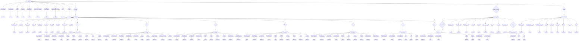

```mermaid
flowchart TD
    E[Teams]-->E1([CLAVE1:yearID])            -->ED1{{Número>0}}
    E[Teams]-->E2([CLAVE2:teamID])            -->ED2{{Texto3}}
    E[Teams]-->E3([League])                   -->ED3{{Texto2}}
    E[Teams]-->E4([Franchise])                -->ED4{{Texto50}}
    E[Teams]-->E5([Team_division])            -->ED5{{Texto50}}
    E[Teams]-->E6([Position_final_standings]) -->ED6{{Número>0}}
    E[Teams]-->E7([Games_played])             -->ED7{{Número>0}}
    E[Teams]-->E8([Games_played_at_home])     -->ED8{{Número>0}}
    E[Teams]-->E9([Wins])                     -->ED9{{Número>0}}
    E[Teams]-->E10([Losses])                  -->ED10{{Número>0}}

    E[Teams]  -- N --> EA{Contratan} -- N -->A[Master]

    A[Master] -->A1([CLAVE:PlayerID])-->AD1{{Texto9}}
    A[Master] -->A2([birthYear])    --> AD2{{Número>0}}
    A[Master] -->A3([birthMonth])   --> AD3{{Número>0}}
    A[Master] -->A4([birthDay])     --> AD4{{Número>0}}
    A[Master] -->A5([birthCountry]) --> AD5{{Texto50}}
    A[Master] -->A6([birthState])   --> AD6{{Texto50}}
    A[Master] -->A7([birthCity])    --> AD7{{Texto50}}
    A[Master] -->A8([deathYear])    --> AD8{{Número>0}}
    A[Master] -->A9([deathMonth])   --> AD9{{Número>0}}
    A[Master] -->A10([deathDay])    --> AD10{{Número>0}}

    B[Batting]-->B1([CLAVE1:playerID]) --> BD1{{Texto9}}
    B[Batting]-->B2([CLAVE2:yearID])   --> BD2{{Número>0}}
    B[Batting]-->B3([CLAVE3:stint])    --> BD3{{Número>0}}
    B[Batting]-->B4([CLAVE4:teamID])   --> BD4{{Texto3}}
    B[Batting]-->B5([League])          --> BD5{{Texto2}}
    B[Batting]-->B6([Games])           --> BD6{{Número>0}}
    B[Batting]-->B7([At_Bats])         --> BD7{{Número>0}}
    B[Batting]-->B8([Runs])            --> BD8{{Número>0}}
    B[Batting]-->B9([Hits])            --> BD9{{Número>0}}
    B[Batting]-->B10([Doubles])        --> BD10{{Número>0}}

    A[Master] -- 1 --> AB{Batea} -- N -->B[Batting]

    C[Fielding]-->C1([CLAVE1:playerID]) -->CD1{{Texto9}}
    C[Fielding]-->C2([CLAVE2:yearID])   -->CD2{{Número>0}}
    C[Fielding]-->C3([CLAVE3:stint])    -->CD3{{Número>0}}
    C[Fielding]-->C4([CLAVE4:teamID])   -->CD4{{Texto3}}
    C[Fielding]-->C5([CLAVE5:POS])      -->CD5{{Texto2}}
    C[Fielding]-->C6([League])          -->CD6{{Texto2}}
    C[Fielding]-->C7([Games])           -->CD7{{Número>0}}
    C[Fielding]-->C8([Games_Started])   -->CD8{{Número>0}}
    C[Fielding]-->C9([Time_played_in_field])-->CD9{{Número>0}}
    C[Fielding]-->C10([Putouts])        -->CD10{{Número>0}}

    A[Master] -- 1 --> AC{Juega} -- N -->C[Fielding]

    D[Pitching]-->D1([CLAVE1:playerID])-->DD1{{Texto9}}
    D[Pitching]-->D2([CLAVE2:yearID])  -->DD2{{Número>0}}
    D[Pitching]-->D3([CLAVE3:stint])   -->DD3{{Número>0}}
    D[Pitching]-->D4([CLAVE4:teamID])  -->DD4{{Texto3}}
    D[Pitching]-->D5([League])         -->DD5{{Texto2}}
    D[Pitching]-->D6([Wins])           -->DD6{{Número>0}}
    D[Pitching]-->D7([Losses])         -->DD7{{Número>0}}
    D[Pitching]-->D8([Games])          -->DD8{{Número>0}}
    D[Pitching]-->D9([Games_Started])  -->DD9{{Número>0}}
    D[Pitching]-->D10([Complete_Games])-->DD10{{Número>0}}

    A[Master] -- 1 --> AD{Lanza} -- N -->D[Pitching]

    K[BattingPost]-->K1([CLAVE1:playerID]) --> KD1{{Texto9}}
    K[BattingPost]-->K2([CLAVE2:yearID])   --> KD2{{Número>0}}
    K[BattingPost]-->K3([CLAVE3:stint])    --> KD3{{Número>0}}
    K[BattingPost]-->K4([CLAVE4:teamID])   --> KD4{{Texto3}}
    K[BattingPost]-->K5([League])          --> KD5{{Texto2}}
    K[BattingPost]-->K6([Games])           --> KD6{{Número>0}}
    K[BattingPost]-->K7([At_Bats])         --> KD7{{Número>0}}
    K[BattingPost]-->K8([Runs])            --> KD8{{Número>0}}
    K[BattingPost]-->K9([Hits])            --> KD9{{Número>0}}
    K[BattingPost]-->K10([Doubles])        --> KD10{{Número>0}}

    A[Master] -- 1 --> AK{Batea} -- N -->K[BattingPost]

    L[PitchingPost]-->L1([CLAVE1:playerID])-->LD1{{Texto9}}
    L[PitchingPost]-->L2([CLAVE2:yearID])  -->LD2{{Número>0}}
    L[PitchingPost]-->L3([CLAVE3:stint])   -->LD3{{Número>0}}
    L[PitchingPost]-->L4([CLAVE4:teamID])  -->LD4{{Texto3}}
    L[PitchingPost]-->L5([League])         -->LD5{{Texto2}}
    L[PitchingPost]-->L6([Wins])           -->LD6{{Número>0}}
    L[PitchingPost]-->L7([Losses])         -->LD7{{Número>0}}
    L[PitchingPost]-->L8([Games])          -->LD8{{Número>0}}
    L[PitchingPost]-->L9([Games_Started])  -->LD9{{Número>0}}
    L[PitchingPost]-->L10([Complete_Games])-->LD10{{Número>0}}

    A[Master] -- 1 --> AL{Lanza} -- N -->L[PitchingPost]

    I[AwardsPlayers]-->I1([CLAVE1:playerID])-->ID1{{Texto9}}
    I[AwardsPlayers]-->I2([CLAVE2:awardID]) -->ID2{{Texto50}}
    I[AwardsPlayers]-->I3([CLAVE3:yearID])  -->ID3{{Número>0}}
    I[AwardsPlayers]-->I4([lgID])           -->ID4{{Texto2}}
    I[AwardsPlayers]-->I5([tie])            -->ID5{{Texto1}}
    I[AwardsPlayers]-->I6([notes])          -->ID6{{Texto50}}

    A[Master] -- 1 --> AI{Ganan} -- N -->I[AwardsPlayers]

    F[Salaries]-->F1([CLAVE1:yearID])  -->FD1{{Número>0}}
    F[Salaries]-->F2([CLAVE2:teamID])  -->FD2{{Texto3}}
    F[Salaries]-->F3([CLAVE3:playerID])-->FD3{{Texto9}}
    F[Salaries]-->F4([salary])         -->FD4{{Número>0}}
    F[Salaries]-->F5([League])         -->FD5{{Texto50}}

    A[Master] -- 1 --> AF{Cobran} -- N -->F[Salaries]

    G[Managers]-->G1([CLAVE1:playerID])-->GD1{{Texto9}}
    G[Managers]-->G2([CLAVE2:yearID])  -->GD2{{Número>0}}
    G[Managers]-->G3([CLAVE3:teamID])  -->GD3{{Texto3}}
    G[Managers]-->G4([inseason])       -->GD4{{Número>0}}
    G[Managers]-->G5([League])         -->GD5{{Texto2}}
    G[Managers]-->G6([Games_managed])  -->GD6{{Número>0}}
    G[Managers]-->G7([Wins])           -->GD7{{Número>0}}
    G[Managers]-->G8([Losses])         -->GD8{{Número>0}}
    G[Managers]-->G9([Team_position])  -->GD9{{Número>0}}

    E[Teams] --N --> EG{Tambien_Contratan} -- N -->G[Managers]
    G[Managers] --1 --> GF{Tambien_Cobran} -- N -->F[Salaries]

    H[AwardsManagers]-->H1([CLAVE1:playerID]) -->HD1{{Texto9}}
    H[AwardsManagers]-->H2([CLAVE2:awardID])  -->HD2{{Texto50}}
    H[AwardsManagers]-->H3([CLAVE3:yearID])   -->HD3{{Número>0}}
    H[AwardsManagers]-->H4([lgID])        -->HD4{{Texto2}}
    H[AwardsManagers]-->H5([tie])         -->HD5{{Texto1}}

    G[Managers] -- N --> GH{Tambien_Ganan} -- N -->H[AwardsManagers]
    
    J[SeriesPost]-->J1([CLAVE1:yearID])       -->JD1{{Número>0}}
    J[SeriesPost]-->J2([CLAVE2:teamIDwinner]) -->JD2{{Texto3}}
    J[SeriesPost]-->J3([CLAVE3:teamIDloser])  -->JD3{{Texto3}}
    J[SeriesPost]-->J4([round])               -->JD4{{Texto50}}
    J[SeriesPost]-->J5([lgIDwinner])          -->JD5{{Texto2}}
    J[SeriesPost]-->J6([lgIDloser])           -->JD6{{Texto2}}
    J[SeriesPost]-->J7([wins])                -->JD7{{Número>0}}
    J[SeriesPost]-->J8([losses])              -->JD8{{Número>0}}
    J[SeriesPost]-->J9([ties])                -->JD9{{Número>0}}

    E[Teams] -- N --> EJ{Juegan} -- N --> J[SeriesPost]
```
         

